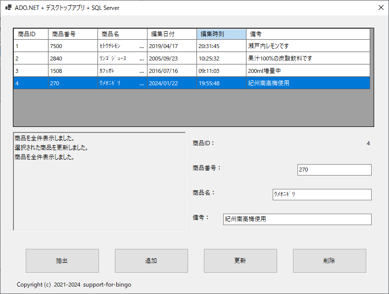

## :computer: Windows Formsで.NET Data Providerを使いSQLServerとの読み書きサンプル  
___
## 開発環境
```
統合開発環境：Microsoft Visual Studio 2022 Community Edition 17.8.5  
プログラム言語：Visual Basic .NET 17.0  
デスクトップ：Windows Formsアプリケーション
フレームワーク：.NET 8.0.1  
開発SDK：.NET SDK 8.0.101  
データベース：Microsoft SQLServer 2022 Express CU11  
-データベース管理ツール：Microsoft SQL Server Management Studio 19.3
NuGetパッケージ：Install-Package Microsoft.Data.SqlClient -Version 5.1.4  
```
  

## 事前準備  
### サンプルプログラムを実行する際のデータベース作成  
Microsoft SQL Server Management Studioのクエリーで以下を実行するかこれ相当をデザイナで作成します。  

### データベース作成(Microsoft SQL Server ManagementStudioでのデフォルト相当)  
※Microsoft SQL Server 2019 Express Editionで名前付きインスタンスが`SQLEXPRESS`の場合のクエリーです。  
別のインスタンス名やSQL Server 2017などのバージョンの場合はPathの**MSSQL15.SQLEXPRESS(ディレクトリ名)**  
が違いますのでご自身のディレクトリ名に合わせて下さい。  
```
use [master]
CREATE DATABASE AdoNetSample
ON
(NAME=AdoNetSample,FILENAME='C:\Program Files\Microsoft SQL Server\MSSQL16.SQLEXPRESS\MSSQL\DATA\AdoNetSample.mdf',SIZE=8MB,FILEGROWTH=64MB)
LOG ON
(NAME=AdoNetSample_log,FILENAME='C:\Program Files\Microsoft SQL Server\MSSQL16.SQLEXPRESS\MSSQL\DATA\AdoNetSample_log.ldf',SIZE=8MB,FILEGROWTH=64MB)
	
ALTER DATABASE AdoNetSample SET AUTO_CLOSE OFF
```

### テーブル作成  
```
use [master]
create table [AdoNetSample].[dbo].[ShohinDataDesk] (
	NumId int NOT NULL IDENTITY(1,1),	/*自動連番*/
	ShohinNum smallint NOT NULL,		/*商品番号*/
	ShohinName char(50),			/*商品名*/
	EditDate decimal(8,0) NOT NULL,		/*編集日付*/
	EditTime decimal(6,0) NOT NULL,		/*編集時刻*/
	Note varchar(255),			/*備考*/
	primary key (NumId))
```

### サンプルデータ追加  

```
use [master]
insert into [AdoNetSample].[dbo].[ShohinDataDesk]
	(ShohinNum, ShohinName, EditDate, EditTime, Note) values
	(7500,'ｾﾄｳﾁﾚﾓﾝ',20190417,203145,'瀬戸内レモンです')
insert into [AdoNetSample].[dbo].[ShohinDataDesk]
	(ShohinNum, ShohinName, EditDate, EditTime, Note) values
	(2840,'ﾘﾝｺﾞｼﾞｭｰｽ',20050923,102532,'果汁100%の炭酸飲料です')
insert into [AdoNetSample].[dbo].[ShohinDataDesk]
	(ShohinNum, ShohinName, EditDate, EditTime, Note) values
	(1508,'ｶﾌｪｵﾚ',20160716,91103,'200ml増量中')
insert into [AdoNetSample].[dbo].[ShohinDataDesk]
	(ShohinNum, ShohinName, EditDate, EditTime, Note) values
	(270,'ｳﾒｵﾆｷﾞﾘ',20080825,141520,'none')
```